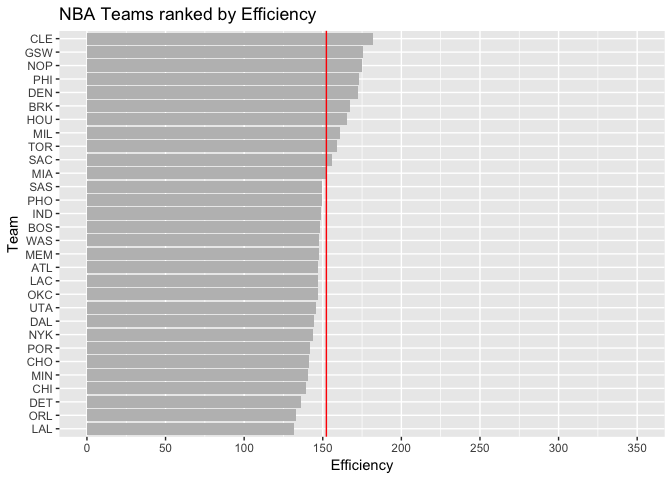
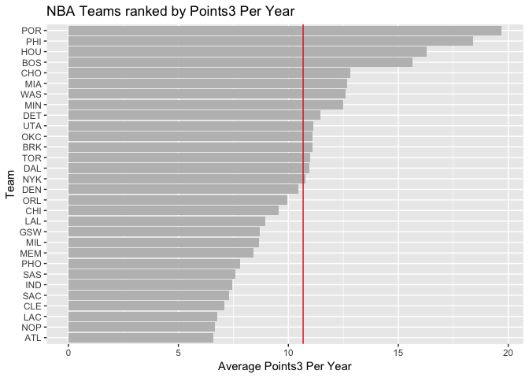

Workout1-Yitong-Bai
================
Cora Bai
9/30/2018

``` r
library("ggplot2")
```

    ## Warning: package 'ggplot2' was built under R version 3.4.4

``` r
teams = read.csv("/Users/Cora/Desktop/133/Workout1/Data/nba2018-teams.csv")
sorted = teams[order(teams$salary, decreasing = TRUE), ]
ggplot(sorted, aes(x = reorder(sorted$team, sorted$salary), y = sorted$salary))+ 
  geom_bar(stat = 'identity', fill = "grey")+ coord_flip()+
  labs(x = "Team", y = "Salary (in millions)", title = "NBA Teams ranked by Total Salary")+ 
  scale_y_continuous(limits = c(0,140), breaks = seq(0,120, by =40))+
  geom_hline(yintercept = mean(sorted$salary), col ="red")
```


``` r
ggplot (sorted, aes(x = reorder(sorted$team, sorted$points), y = sorted$points)) +
  geom_bar(stat = 'identity', fill = "grey")+ coord_flip()+ labs(x = "Team", y = "Points", title = "NBA Teams ranked by Total Points") + 
  scale_y_continuous(limits = c(0,10000),breaks = seq(2500,10000, by =1500)) +
  geom_hline(yintercept = mean(sorted$points), col ="red")
```


``` r
ggplot(sorted, aes(x = reorder(sorted$team, sorted$efficiency), y = sorted$efficiency))+ 
  geom_bar(stat = 'identity', fill = "grey")+ coord_flip()+
  labs(x = "Team", y = "Efficiency", title = "NBA Teams ranked by Efficiency")+ 
   scale_y_continuous(limits = c(0,350), breaks = seq(0,350, by =50))+
  geom_hline(yintercept = mean(sorted$efficiency), col ="red")
```



My own index is called points3 per year, which means the average number of points3 that a player get. My reasoning is that points3 is a good measurement of a player's skills and preciseness. However, the total number of points3 may be affected by the experience (the older the player is, the more likely he/she has more points3). Therefore, use points3/experience is a good indicator.

``` r
avg_points3 = sorted$points3 / sorted$experience
 ggplot(sorted, aes(x = reorder(sorted$team, avg_points3), y = avg_points3))+ 
  geom_bar(stat = 'identity', fill = "grey")+ coord_flip()+
  labs(x = "Team", y = "Average Points3 Per Year", title = "NBA Teams ranked by Points3 Per Year")+ 
  geom_hline(yintercept = mean(avg_points3), col ="red")
```



Comments and Reflections
------------------------

-   It is my first time working on building complete file structure, and I feel it is a really detail-oriented and time-consuming work.
-   This is not my first time using relative path, but I still made mistakes because the console location might be different from the location of md or rmd file. That is really confusing to me.
-   This is my first time writing Rscript, and just writing code is not that straightforward. But it is abstract.
-   I think ggplot2 is still hard for me to memorize all variables.
-   I think the command line and git is easy.
-   I finished the project on my own. I searched for R functions online (Stackoverflow).
-   The most time consuming part is creating the dictionary as I was not that familiar with markdown syntax.
-   The interesting part would be git push.
